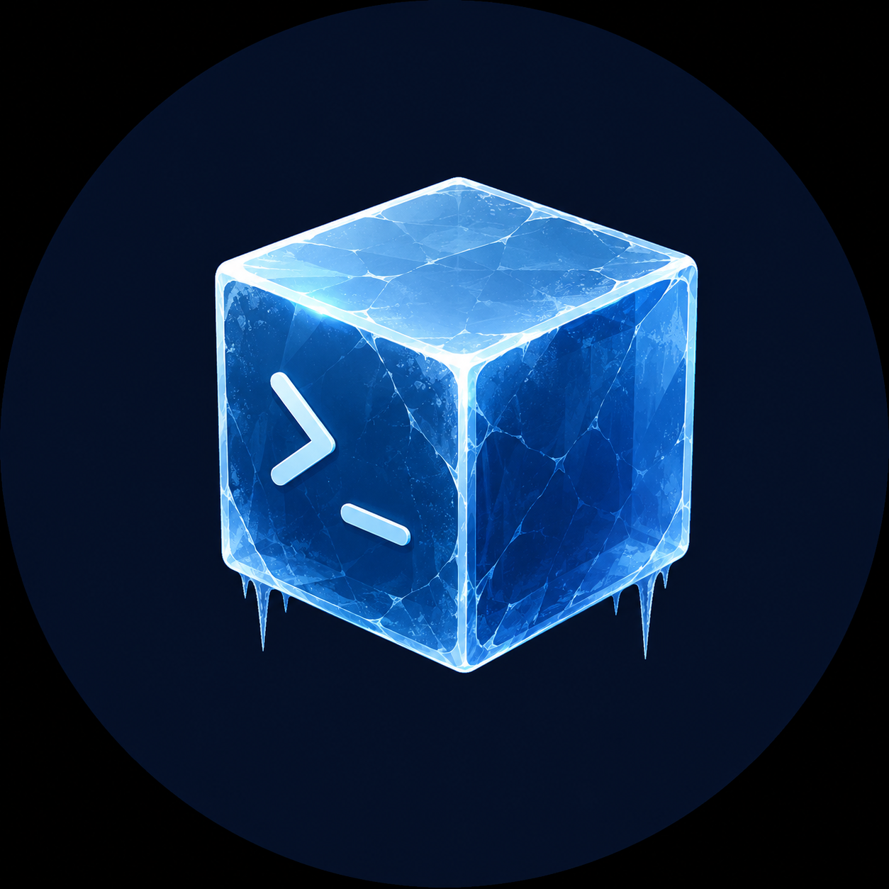

<div align="center">



# cold-shower

**The reality check your vibe-coded app didn't ask for.**

[](https://www.npmjs.com/package/cold-shower)
[](LICENSE)
[](https://claude.ai/code)
[](#-benchmark-results)

*One install. Four modes. Auto-triggers. No commands to memorize.*

</div>

---

<div align="center">

### Why this exists

| | |
|:---:|:---:|
| **65%** of vibe-coded apps have a security vulnerability | **2×** more secrets leaked in AI-assisted commits |
| **45%** of AI-generated code fails security checks | **100%** of repos in our benchmark had issues |

*Sources: Escape.tech · Veracode 2026 · GitGuardian 2026 · [cold-shower benchmark](BENCHMARKS.md)*

</div>

---

## ⚡ Four modes, one skill

```
┌──────────────┬──────────────────┬────────────────┬─────────────────┐
│  🔍 AUDIT    │  📋 PLAN-GATE    │   🧠 RECALL    │  📅 DAILY BRIEF │
│              │                  │                │                 │
│  6 parallel  │  Structured plan │  Persistent    │  Auto-shows     │
│  audits →    │  BEFORE any      │  second brain  │  what you left  │
│  Vibe Score  │  code. Hook      │  across all    │  off when you   │
│  0–100       │  blocks edits    │  sessions.     │  open next day. │
│              │  until APPROVED. │  Replaces      │  No command.    │
│              │                  │  Obsidian.     │  Zero of 6 AI   │
│  "audit me"  │  "implement X"   │ "remember this"│  tools do this. │
└──────────────┴──────────────────┴────────────────┴─────────────────┘
```

---

## 🚿 Install

```bash
npx cold-shower install
```

Or with curl:
```bash
curl -fsSL https://raw.githubusercontent.com/PradiptaPutra/cold-shower/main/install.sh | bash
```

Works on every Claude Code project you open after that. **No commands to memorize.**

| Hook | Event | Does |
|------|-------|------|
| `activate.js` | `SessionStart` | Injects skill + loads brain memories |
| `trigger.js` | `UserPromptSubmit` | Detects intent, routes to correct mode |
| `gate.js` | `PreToolUse` | Blocks edits until plan approved |
| `capture.js` | `Stop` | Suggests memories to save at session end |

---

## 🤖 Auto-triggers — you never type a command

| You say... | Mode | What happens |
|-----------|------|-------------|
| *(open new session next day)* | 📅 | Daily brief auto-injects — no command needed |
| `"what should I work on today"` | 📅 | Prioritized plan from last session context |
| `"audit my codebase"` | 🔍 | Full 6-audit health check → Vibe Score |
| `"is this ready to deploy?"` | 🔍 | Pre-deploy gate scan |
| `"my LLM bill is insane"` | 🔍 | Cost audit → caching + routing fixes |
| `"app crashed on Product Hunt"` | 🔍 | Emergency mode → 5-min triage |
| `"re-audit"` | 🔍 | Re-runs, compares to last score |
| `"implement stripe payments"` | 📋 | Structured plan → blocks edits until APPROVED |
| `"fix this bug"` | 📋 | Plan first, then implementation |
| `"I committed my .env"` | 🔴 | Rotate secrets + scrub git history |
| `"remember this decision"` | 🧠 | Saves to brain with WHY + date |
| `"what did we decide about auth"` | 🧠 | Searches brain files |

---

## 📊 Audit output

```
╔══════════════════════════════════════════════════════════════╗
║  🧊 COLD SHOWER — myapp — 2026-06-29                        ║
╚══════════════════════════════════════════════════════════════╝

📊 Last score: 49/100 (D) on 2026-05-14 — let's see if it improved.

VIBE SCORE: 75/100  Grade: B  ▲ +26 from last audit
━━━━━━━━━━━━━━━━━━━━━━━━━━━━━━━━━━━━━━━━━━━━━━━━━━━━━━━━━━━━━

[A] LLM COSTS      — ✅ CLEAN
[B] AI SECURITY    — 1 issue  (no per-user token budget)
[C] CODE HEALTH    — 3 god files | 2.9% dup | 0 floating promises
[D] DEPENDENCIES   — 18 moderate CVEs (dev-only) | 0 critical
[E] PROD READINESS — ✅ CLEAN
[F] GIT/DEVOPS     — 2 issues (no Dependabot, no branch protection)

🔴 CRITICAL — None

🟡 HIGH
  [B] No per-user token budget — one user can drain your API key
  [C] AppShell.tsx 1,768 lines — auth+routing+sidebar in one file

🟢 QUICK WINS
  Add .github/dependabot.yml                    15 min
  Enable branch protection on main               5 min
━━━━━━━━━━━━━━━━━━━━━━━━━━━━━━━━━━━━━━━━━━━━━━━━━━━━━━━━━━━━━
Score saved · 2 entries · type re-audit after next sprint
```

---

## 🔍 What each audit catches

| Audit | Key checks |
|-------|-----------|
| 🤑 **A — LLM Costs** | Missing semantic cache, hardcoded expensive model, unbounded history |
| 🔐 **B — AI Security** | Prompt injection, PII sent to LLM, no per-user budget, jailbreak surface |
| 🧹 **C — Code Health** | God files >500 lines, circular deps, duplicate logic >10%, floating promises |
| 📦 **D — Dependencies** | Unused packages (knip), CVEs (npm audit), archived libs |
| 🚀 **E — Prod Readiness** | N+1 queries, no rate limits, connection pool exhaustion |
| 🛡️ **F — Git/DevOps** | `.env` committed, unpinned Actions, no CI, no branch protection |

> **Audit F alone is worth the install.** CVE-2025-30066 (March 2025): floating `@v4` Action tag rewritten — 23,000 repos exposed overnight. Audit F catches every unpinned tag.

---

## 📈 Benchmark Results

Ran cold-shower across **15 public JS/TS repos**. [Full results →](BENCHMARKS.md)

```
🔴 VULNERABLE APPS              avg 73/100
   NodeGoat      75/100  B  ███████████████░░░░░  7 issues
   juice-shop    62/100  C  ████████████░░░░░░░░  7 issues
   dvna          83/100  B  █████████████████░░░  5 issues

🟡 STARTUP APPS                 avg 67/100
   cal.com       76/100  B  ███████████████░░░░░  4 issues
   hoppscotch    74/100  C  ███████████████░░░░░  3 issues
   plane         62/100  C  ████████████░░░░░░░░  6 issues
   documenso     57/100  D  ███████████░░░░░░░░░  6 issues
```

| Stat | Result |
|------|--------|
| Repos with issues | **15 / 15 (100%)** |
| Avg scan time | **17.3 seconds** |
| Score gap: clean vs vulnerable | **+14 pts** |
| Most common miss | No Dependabot (12/15 repos) |

---

## 📅 Daily Brief — never start from zero again

Close your laptop. Open it tomorrow. cold-shower shows exactly where you left off — automatically.

```
┌──────────────────────────────────────────────────────────┐
│  🧊 DAILY BRIEF — myapp — Monday Jun 30                  │
│  Last session: Sunday 11:47 PM (8h 12m ago)              │
│  Branch: feature/auth-refactor                           │
├──────────────────────────────────────────────────────────┤
│  Left off:                                               │
│    - implementing stripe webhook handler                 │
│    - still need to test refund flow                      │
├──────────────────────────────────────────────────────────┤
│  Files touched:                                          │
│    · src/api/webhooks.ts                                 │
│    · src/lib/stripe.ts                                   │
├──────────────────────────────────────────────────────────┤
│  Ask: 'what should I work on today' for today's plan     │
└──────────────────────────────────────────────────────────┘
```

Claude's first response:
> Welcome back. You were implementing the stripe webhook handler with the refund flow still incomplete.
>
> Best first task today: finish the refund test in `src/lib/stripe.ts` — it's 60% done.
>
> Want me to open it and pick up where you left off?

**How it works:**
- `capture.js` (Stop hook) — at session end, extracts files touched, decisions made, in-progress items → writes `~/.claude/projects/<project>/brain/progress.md`
- `activate.js` (SessionStart hook) — detects new day OR >4h gap → reads progress.md → injects brief
- Atomic lock (`brief-lock-YYYY-MM-DD.lock`) — if you have 3 terminals open, only 1 shows the box. All 3 have the context.
- Project-scoped — `/my-app` and `/deep-research` each get their own brief

**Zero of 6 major AI coding tools do this.** Cursor, Windsurf, GitHub Copilot Workspace, Amp, Kiro, Zed all start from scratch every session.

---

## 📋 Plan-gate — no more AI slop

Every `"implement X"` or `"fix X"` generates a plan **before writing a single line**:

```markdown
## Plan: Add Stripe payments

### Files to Touch
| File                  | Change        |
|-----------------------|---------------|
| src/checkout/Form.tsx | Add Stripe UI |
| src/api/payments.ts   | New endpoint  |

### Files NOT to Touch
| File                   | Reason                        |
|------------------------|-------------------------------|
| src/auth/middleware.ts | Fragile — race condition #234 |

### Pre-Mortem
"Most likely failure: webhook arrives before order row exists."

### Rollback
Revert 3 files. No migration needed.
```

→ **Type `APPROVED` to proceed.**

The `PreToolUse` hook **physically blocks** all `Edit`/`Write` calls until approved.
**No other Claude Code skill enforces planning at the hook level.**

---

## 🧠 Recall — second brain without Obsidian

| | Obsidian + MCP | cold-shower recall |
|--|---------|-------------------|
| Setup | Separate app + vault + MCP config | Included in install |
| Capture | Manual note-taking | `"remember this"` or auto-suggested |
| Token cost per session | **~7M tokens** (full vault scan) | **~100 tokens** (grep) |
| Anti-regression | ❌ | ✅ Warns before touching fragile files |
| Survives context loss | Manually | Automatically |

```
~/.claude/brain/
  preferences.md              ← global preferences across all projects
~/.claude/projects/myapp/brain/
  decisions.md                ← "chose Supabase — Prisma 380KB kills edge cold start"
  avoid.md                    ← "don't touch auth — race condition, fixed 3 times"
  bugs.md                     ← "N+1 in getUserList, fixed 2026-05-01, regression-prone"
  context.md                  ← domain knowledge, user base, compliance requirements
```

---

## 🏃 Fix sprints

Each sprint generates **working code files** — not a todo list.

| Sprint | Time | What gets generated |
|--------|------|-------------------|
| **0.5** 🔴 | 15 min | Secret rotation + `git filter-repo` history scrub |
| **1** | 30 min | Dep cleanup + `knip.json` |
| **2** | 2 hr | Rate limiting + async error handling |
| **3** | 2 hr | Connection pool fix + N+1 detection |
| **4** | 4 hr | `lib/llm-cache.ts` + `lib/llm-router.ts` + `lib/llm-client.ts` |
| **5** | 1 day | God component extraction playbook |
| **6** | 1 hr | `ci.yml` + `dependabot.yml` + `src/env.ts` + branch protection |

Sprint 0.5 fires **before everything else** if `.env` is committed.

---

## 🆚 vs other top skills

| | 🪨 caveman | 🐴 ponytail | 🧊 cold-shower |
|--|-----|-----|-----|
| **What it fixes** | How Claude *talks* | What Claude *builds* | What you *already shipped* |
| **When it acts** | During session | During coding | Retrospective + pre-deploy |
| **Hook enforcement** | ❌ soft | ❌ soft | ✅ PreToolUse hard block |
| **Generates fix code** | ❌ | ❌ | ✅ real TS/JS files |
| **Persistent memory** | ❌ | ❌ | ✅ survives sessions |
| **Score over time** | ❌ | ❌ | ✅ history + trend |
| **Daily brief** | ❌ | ❌ | ✅ auto on session start |

> caveman fixes verbosity. ponytail fixes over-engineering. cold-shower fixes what's already in production.
> **Install all three — they don't overlap.**

---

## 📋 Requirements

- [Claude Code](https://claude.ai/code) — uses native hook system
- Node.js 18+
- `gh` CLI — optional, enables branch protection check in Audit F

---

## 🗺️ Roadmap

- [x] Benchmarks — 15-repo study published ([BENCHMARKS.md](BENCHMARKS.md))
- [x] Daily Brief — auto session context on new day (0 of 6 competitors have this)
- [ ] Cursor `.cursorrules` port
- [ ] `cold-shower diff` — scan only PR-changed files
- [ ] Product Hunt launch

---

<div align="center">

MIT &nbsp;·&nbsp; [npm](https://www.npmjs.com/package/cold-shower) &nbsp;·&nbsp; [Benchmarks](BENCHMARKS.md) &nbsp;·&nbsp; [Issues](https://github.com/PradiptaPutra/cold-shower/issues) &nbsp;·&nbsp; [PradiptaPutra](https://github.com/PradiptaPutra)

</div>
